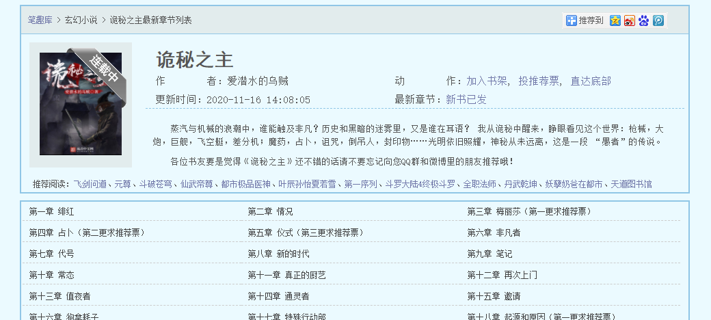

# 笔趣阁小说下载器

> [默认配置](https://www.biquduo.com/)

## 使用方式

从以上网址（或配置文件中对应网址）中找到需要的书籍主页（可以看到目录的页面），然后将url复制下来作为参数。

```powershell
.\bqg.exe <url>

# 更多选项
.\bqg.exe -h

# 报下载错误，尝试
.\bqg.exe --ex <url>
```




## 配置

通过配置文件可以配置CSS选择器和域名，从而用于类似的小说网站。

---

如果仅需要配置文件，只需运行`.\bqg.exe -v`即可，或者从config中选择一个模板并重命名为`bqg.yml`。
